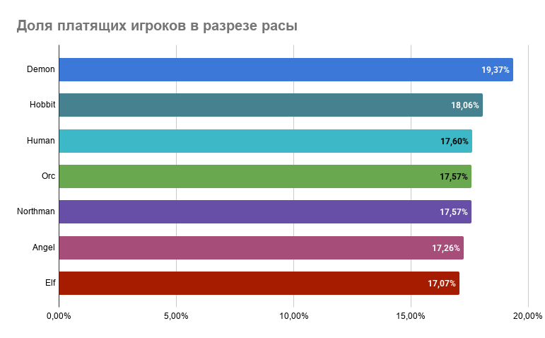
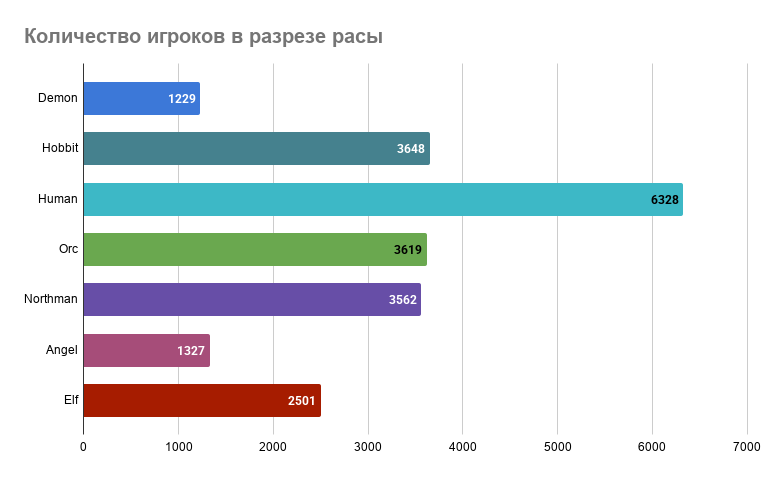
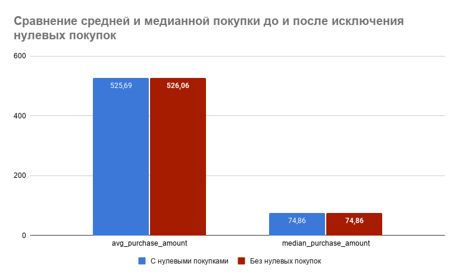
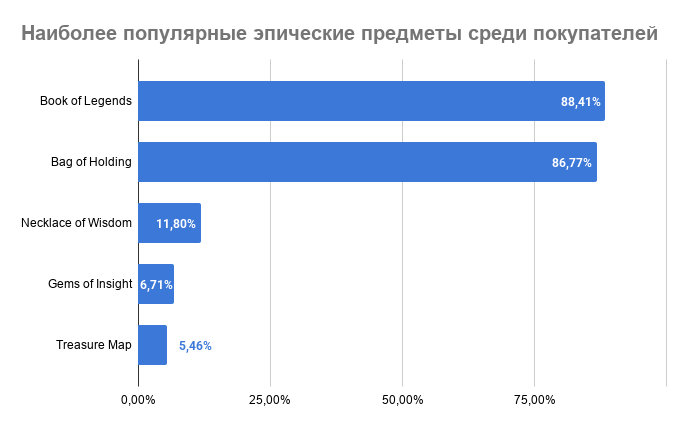
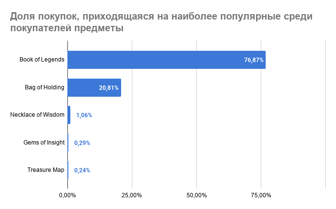
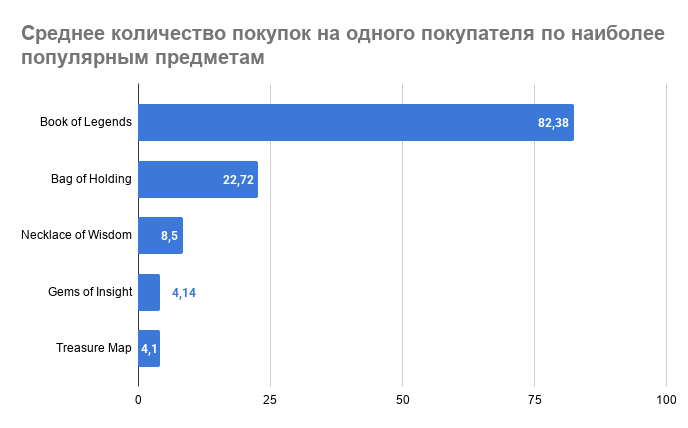
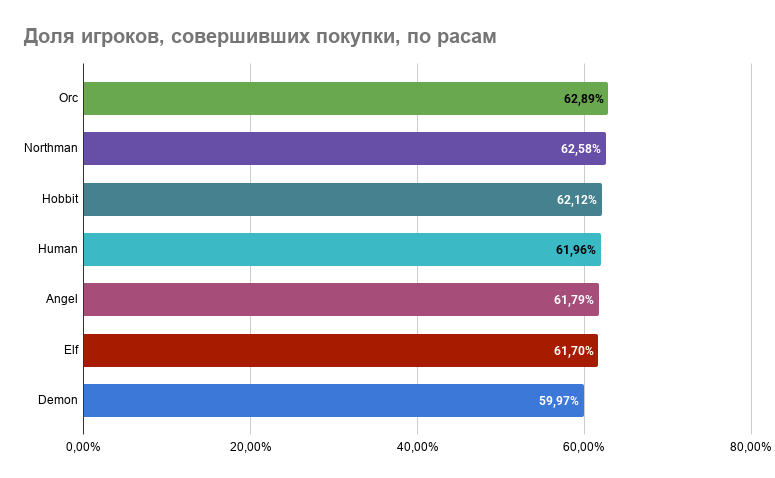
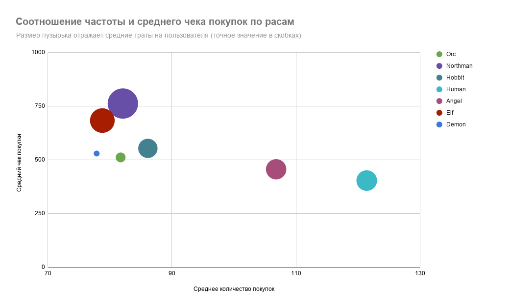

# Анализ внутриигровой экономики «Секреты Темнолесья»

*Учебный проект (курс SQL, Яндекс.Практикум)*

## Контекст
Продажа внутриигровой валюты «райские лепестки» – основной источник дохода разработчика игры «Секреты Темнолесья». За «райские лепестки» пользователь может покупать эпические предметы, которые дают преимущество при прохождении игры. «Райские лепестки» можно получить за прохождение сложных квестов или купить за реальные деньги. Покупать эпические предметы можно у других игроков, торговцев и внутри игрового приложения. Команда планирует привлекать платящих игроков через рекламу и хочет понимать, кто эти игроки и как происходит покупка.

## Цель проекта
Проверить, как влияет раса персонажа на покупки игроков, а также какие эпические предметы наиболее и наименее популярны среди игроков.

## Бизнес-постановка
Если есть зависимость в количестве покупок и средних суммах оплат игроков в зависимости от расы их персонажа, то эту информацию можно использовать для оптимизации рекламных кампаний, а наличие информации о популярности эпических предметов поможет эффективнее таргетировать рекламу и обеспечивать высокий ROMI.

## Задачи
- Определить долю платящих игроков и проверить, влияет ли раса персонажа на вероятность покупки;
- Детально изучить механику покупки эпических предметов;
- Изучить активность игроков в разрезе рас персонажей.

## Инструменты
SQL (CTE, агрегатные функции с FILTER, JOIN, приведение типов и округление, PERCENTILE_CONT), DBeaver, Google Sheets

## Ключевые выводы

Общая доля платящих игроков - 17,69%. В целом заметной корреляции между долей платящих игроков в зависимости от расы не наблюдается (разброс от 17,07% до 19,37%), поэтому оптимизировать рекламные кампании именно на расы не стоит. 

Наблюдается заметная разница в поведении игроков разных рас. Например, игроки, выбирающие расы Human и Angel тяготеют к частым и недорогим покупкам, поэтому можно предположить, что они с большей вероятностью отреагируют на пакетные предложения или комбо их эпических предметов. А вот игроки, выбирающие расы Northman и Elf, обычно покупают редко, но сразу относительно дорогие предметы, поэтому они могут положительно отреагировать на рекламу новых уникальных эпических предметов.

При подготовке рекламных кампаний стоит также учитывать платёжеспособность игроков. Среди покупок встречаются транзакции на крупные суммы, что указывает на присутствие сегмента «китов». Выявление и отдельный анализ этого сегмента может быть отдельным направлением для дальнейшего исследования (например, оценка его вклада в общую выручку и подбор эффективных инструментов удержания).

Сами эпические предметы показывают сильную асимметрию в количестве продаж и ТОП-5 предметов (Book of Legends, Bag of Holding, Necklace of Wisdom, Gems of Insight, Treasure Map) обеспечивают 99,88% всех продаж, тем самым доказывая свою популярность. Рекламный бюджет будет более эффективно концентрировать на популярных товарах, чем распределять по всему списку товаров в том числе, с единичными продажами.

## Детали анализа

### Доля платящих игроков по расам

Доли платящих игроков в разрезе расы варьируются незначительно от 17,07% до 19,37%. Игроки расы Demon занимают первое место по доле платящих игроков (19,37%), а игроки расы Elf являются наименее платящими (17,07%).

Можно сделать вывод, что раса может не влиять на то, станет ли игрок платящим или нет. 

Стоит отметить, расы, которые выделяются по количеству зарегистрированных и, соответственно, платящих игроков: пользователи выбирают расу Human (6328 игроков) почти в 2 раза чаще, чем среднее значение (~3173 игроков), а расы Angel (1327 игроков) и Demon (1229 игроков) выбирают в 2,6 и 2,4 раза реже, чем в среднем соответственно. Таким образом, игроки расы Demon при своей редкости всё равно являются чуть более активно платящими. 

### Статистика продаж
Общее количество покупок - 1 307 678 на сумму 686 615 040 усл. единиц.

Стоит обратить внимание на разницу между средней покупкой 525,69 и медианным значением 74,86, стандартное отклонение - 2517,35. Такая разница свидетельствует, что среди покупок достаточно большой разброс цены: большое количество небольших покупок менее 74,86, но при этом есть и очень крупные. Размах (значение 486 615,1) также показывает наличие выбросов справа.

В результате анализа данных выявлено, что среди покупок есть аномальные транзакции на сумму 0 (907 шт. - 0,07% от всех транзаций). Они не приносят компании выручку.

Если анализировать данные без учета транзакций на нулевые суммы, то статистические показатели изменяются незначительно (средняя после исключения - 526,06, медиана - 74,86, стандартное отклонение - 2518,18), что может быть связано с небольшой долей нулевых транзакций.

### Популярность эпических предметов

ТОП-5 популярных товаров:
 -	**Book of Legends** доля пользователей, купивших товар хотя бы раз – 88,41% и долей среди всех предметов 76,87%. 
 -	**Bag of Holding** с долей среди пользователей 86,77% и долей продаж среди всех предметов 20,81%.
 - **Necklace of Wisdom** с долей среди пользователей 11,8% и долей продаж среди всех предметов 1,06%.
 -	**Gems of Insight** с долей среди пользователей 6,71% и долей продаж среди всех предметов 0,9%.
 -	**Treasure Map** с долей среди пользователей 5,46% и долей продаж среди всех предметов 0,24%.

Важно обратить внимание, что разница между долями продаж среди всех предметов первого и второго места сильно отличается (разница составляет 56,06%), то есть покупают Book of Legends гораздо чаще, чем Bag of Holding. Но если смотреть с точки зрения доли купивших пользователей, то такой значительной разницы нет (разница долей всего 1,64%), что говорит, что одни и те же игроки покупают Book of Legends по несколько раз. Что подтверждает расчет среднего количества покупок предмета на одного пользователя: Book of Legends купили в среднем 82,38 раза, а Bag of Holding только 22,72 раза. 

Между вторым и третьим местом по популярности есть сильный разрыв: доля среди покупателей, купивших Necklace of Wisdom, меньше на 74,97%, а доля продаж среди всех предметов ниже на 19,75%. Среднее количество покупок на пользователя для Necklace of Wisdom (8,5) заметно ниже, чем у лидеров ТОП-2 (82,38 и 22,72), но всё же превышает 1, то есть часть заинтересовавшихся пользователей покупает предмет повторно, просто с меньшей интенсивностью, чем самые популярные товары. Дальнейшее падение долей продаж предметов становится более плавным.

Распределение текущих продаж предельно сконцентрировано: два товара (Book of Legends, Bag of Holding) обеспечивают почти 97,68% всех эпических покупок. Это говорит в пользу концентрации рекламного бюджета на проверенных, доказавших спрос товарах, а не равномерного продвижения всего каталога.

Среди эпических предметов есть 22 позиции с единственной зафиксированной покупкой. Часть из них – долговечные предметы (оружие, броня и т.п.), для которых однократная покупка ожидаема и не является тревожным сигналом. Но среди этих 22 есть и расходуемые предметы (свитки, эликсиры), которые логически должны покупаться повторно при реальном интересе — единственная покупка для них скорее указывает на низкую воспринимаемую ценность или непонятное игрокам применение.

Отдельно, сопоставив полный каталог эпических предметов с данными о продажах, обнаружено 39 позиций без единой транзакции вообще. В сумме с 22 однопокупочными предметами (для той части, что расходуемая) существенная доля каталога не находит спроса у игроков. Возможные причины: описание применения недостаточно понятно, либо цена не соответствует воспринимаемой пользе.

Среди всех эпических предметов наиболее популярны Book of Legends, Bag of Holding, Necklace of Wisdom, Gems of Insight, Treasure Map. Поскольку эти предметы уже демонстрируют интерес игроков, они могут стать эффективным материалом для рекламных креативов (например, демонстрация именно этих предметов в рекламных объявлениях), но важно отметить, что имеющиеся данные показывают существующую популярность, а не измеряют эффект самой рекламы на продажи. Для проверки причинного эффекта стоит провести отдельный A/B-тест.

Товары без подтверждённого спроса (39 без продаж + расходуемые с единственной покупкой) – кандидаты не для рекламы, а для отдельного пересмотра цены/описания, поскольку текущие данные не дают оснований ожидать отдачи от их продвижения.

### Активность игроков в разрезе расы

Если рассматривать активность разных рас с точки зрения доли пользователей, совершивших покупки, то выделить яркого лидера невозможно: значения долей для всех рас варьируются от 59,97% до 62,89%.

Если рассматривать активность платящих игроков разных рас, то разброс немного выше, но в целом не позволяющий выделить явно выделяющихся лидеров или аутсайдеров: минимальная доля платящих пользователей от числа пользователей, совершавших транзакции у расы Elf (16,27%), а максимальная доля у расы Demon (19,95%).

Если расценивать активность по среднему количество транзакций, то наиболее активной расой является Human (121,4 транзакции), но при этом средний чек на покупку у этой расы самый низкий (403,08), а сумма общих трат (48933,71) в среднем на пользователя достаточно средняя. Можно предположить, что для прохождения игры за расу Human требуется большое количество достаточно дешевых предметов.

Игроки, выбирающие расу Demon имеют один из самых низких показателей среднего количества покупок (77,87) и не сильно выделяются по среднему чеку (529,02), а общая сумма трат одна из самых низких (41194,5 – предпоследнее место). Можно сделать вывод, что прохождение игры за эту расу достаточно легкое: игроки в среднем покупают реже и на средние суммы и в сумме тратят достаточно мало.

Для игроков с расой Elf есть небольшая диспропорция: среднее количество покупок одно из самых низких - 78,79, но при этом достаточно высокий средний чек – 682,33 (Топ-2) и достаточно высокая общая сумма трат – 53761,21 (Топ-2). То есть игрокам приходится тратить достаточно много средств, хоть и достаточно редко.

Игроки с расой Northman при среднем количестве покупок (82,1), в среднем тратят больше на покупку (средний чек – 761,48 (максимальный), общая сумма трат – 62519,03), чем игроки других рас. То есть можно предположить, что игрокам, выбравшим эту расу, требуется больше тратить денег на прохождение игры.

Доля игроков, совершающих покупки, различается между расами незначительно, что не даёт оснований таргетировать рекламу по принципу «показывать больше/меньше конкретной расе», но при этом заметно различается характер покупательского поведения. Расы, тяготеющие к частым и недорогим покупкам (Human, Angel), могут лучше отзываться на рекламу объёмных или пакетных предложений. Расы с редкими, но крупными покупками (Northman, Elf) могут лучше реагировать на рекламу премиальных, единичных эпических предметов. Это может стать основой для дифференциации рекламного сообщения по расе, а не для избирательного таргетинга самой аудитории.

## Дополнительные рекомендации
1. Есть транзакции с нулевыми продажами: если это промотовары, стоит их разметить, чтобы вести более подробную аналитику по результатам маркетинговых кампаний
2. Стоит обратить внимание на 61 эпический предмет, которые не продаются вовсе или покупались всего 1 раз. Если эти предметы все еще актуальны для игры, то выявить причины непопулярности среди игроков. Это может быть несоответствие цены и пользы предмета, недостаточно полное или понятное описание предметов или их сложно найти. Проработка может помочь увеличить продажи как самих предметов, так и увеличить доходы игры.
3. Провести более детальную сегментацию игроков и их предпочтения в покупках, что поможет делать более качественные рекламные кампании. 
4. Провести анализ баланса рас персонажей, так как есть расы которые позволяют пройти игру с меньшими затратами (компания может недополучать доход), а также есть расы, которые требуют больших финансовых вложений для прохождения, что может влиять на отток игроков, выбирающих эти расы.

## Автор
[Оксана Блюхерова] · [LinkedIn](https://www.linkedin.com/in/oksana-bliukherova/) · [Telegram](https://telegram.me/oksanka1811) · [email](mailto:oksanka1811@gmail.com)
